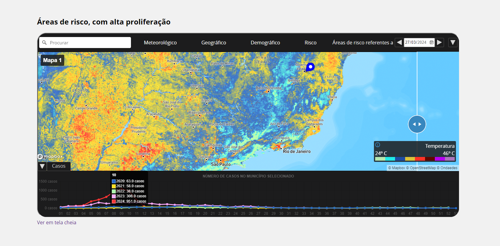
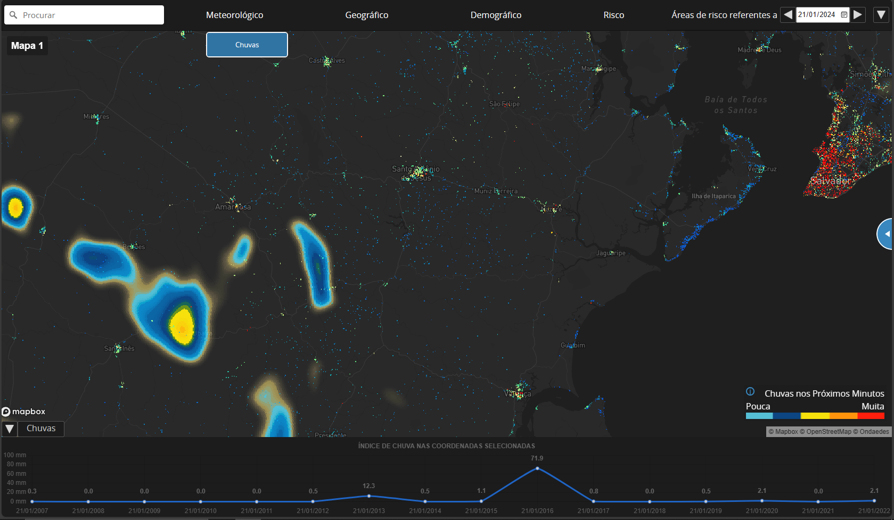
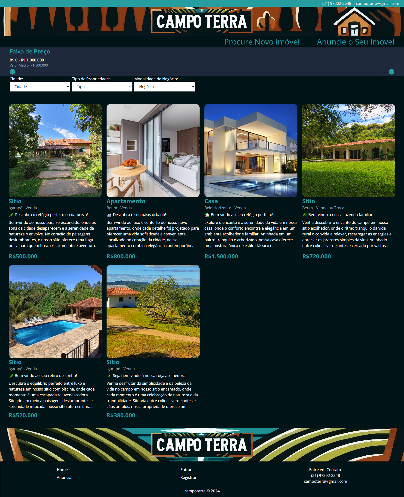
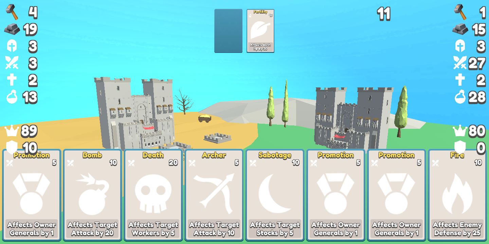
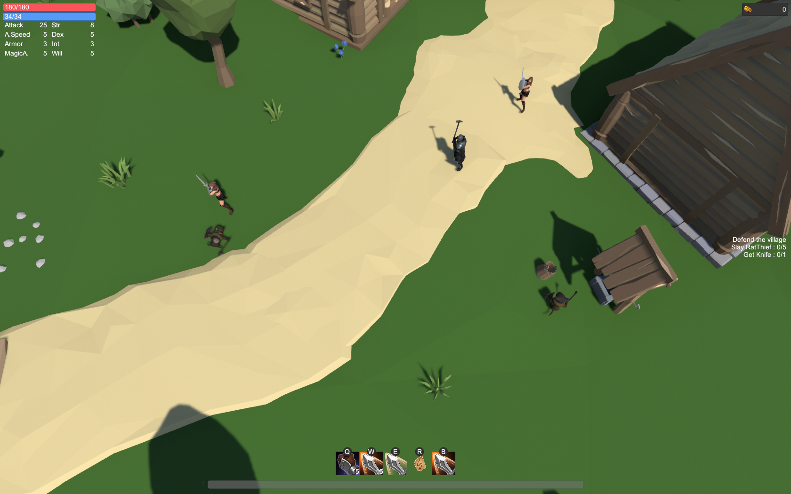

### Hi there 👋

Here goes some stuff.
And don't forget to to check out my [portfolio page](https://davidfrk.github.io/portfolio/).

Georreferenced data application developed for Ondaedes whose focus is on enabling better decision-making in the fight against arboviruses.

Weather forecast and population.

Advertise your listings and secure the best deal with us

Everybody likes raytracing. Right? --

Wanna try a web version? [Do it here!!](https://experimental-web-dev.github.io/pages/webgpu-raytracing.html)

A mobile card game I made.

RPG project, feel free to check it out on [youtube](https://youtu.be/zQUQ5BusM4A).

<!--
**davidfrk/davidfrk** is a ✨ _special_ ✨ repository because its `README.md` (this file) appears on your GitHub profile.

Here are some ideas to get you started:

- 🔭 I’m currently working on ...
- 🌱 I’m currently learning ...
- 👯 I’m looking to collaborate on ...
- 🤔 I’m looking for help with ...
- 💬 Ask me about ...
- 📫 How to reach me: ...
- 😄 Pronouns: ...
- ⚡ Fun fact: ...
-->
